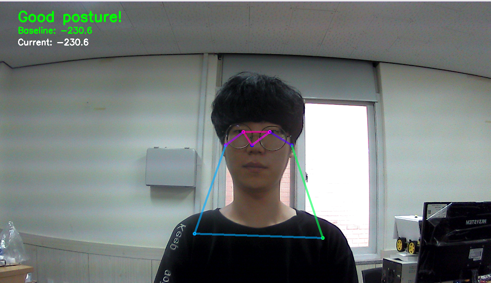
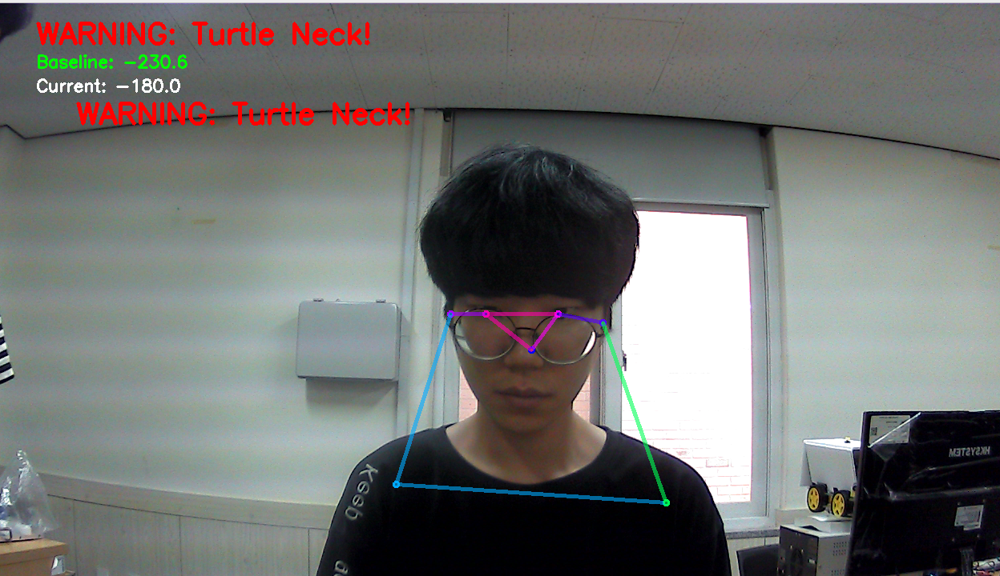
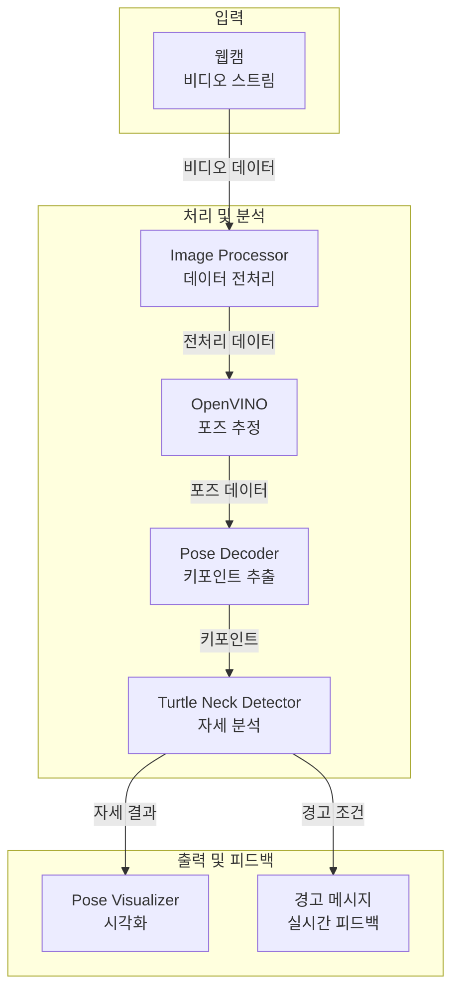
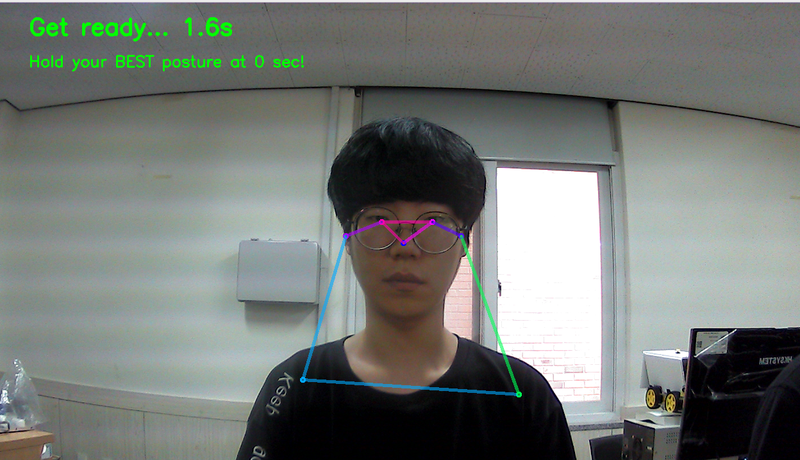

# 🐢 Turtle Neck Detection System

실시간 웹캠을 통한 거북목 자세 감지 및 경고 시스템

## 📸 DEMO

### 작동 화면


### 자세 감지 결과

<div align="center">

| 좋은 자세 | 거북목 감지 |
|:---:|:---:|
|  |  |
| ✅ **Good posture!** | ⚠️ **WARNING: Turtle Neck!** |

</div>

## 📋 목차
- [✨ 주요 기능](#-주요-기능)
- [🏗️ 시스템 아키텍처](#-시스템-아키텍처)
- [🚀 빠른 시작](#-빠른-시작)
- [📁 프로젝트 구조](#-프로젝트-구조)
- [🎮 사용법](#-사용법)
- [⚙️ 설정](#-설정)
- [🔧 시스템 요구사항](#-시스템-요구사항)
- [📦 의존성](#-의존성)
- [🎯 알고리즘 원리](#-알고리즘-원리)
- [🤝 기여하기](#-기여하기)
- [📄 라이선스](#-라이선스)
- [👨‍💻 작성자](#-작성자)
- [🙏 감사의 말](#-감사의-말)

## ✨ 주요 기능

- **실시간 자세 감지**: OpenVINO 기반 포즈 추정
- **개인별 맞춤 보정**: 4초 카운트다운 후 개인 기준점 설정
- **즉시 피드백**: 거북목 감지 시 실시간 경고 메시지
- **정확한 측정**: 코와 어깨 중심점 간의 Y좌표 차이로 정밀 측정
- **시각적 표시**: 자세 스켈레톤 및 키포인트 실시간 시각화
- **모듈화 구조**: 기능별로 분리된 재사용 가능한 모듈

## 🏗️ 시스템 아키텍처

아래 다이어그램은 거북목 감지 시스템의 구성 요소와 데이터 흐름을 보여줍니다:



## 🚀 빠른 시작

### 설치

```bash
git clone https://github.com/JHC1023/ai-posture-corrector.git
cd ai-posture-corrector
pip install -r requirements.txt
```

### 실행

```bash
python main.py
```

## 📁 프로젝트 구조

```
turtle_neck/
├── turtle_neck/              # 메인 모듈
│   ├── __init__.py
│   ├── model_manager.py      # 모델 다운로드 및 관리
│   ├── pose_decoder.py       # OpenPose 디코딩
│   ├── image_processor.py    # 이미지 전처리/후처리
│   ├── turtle_neck_detector.py # 거북목 감지 로직
│   ├── pose_visualizer.py    # 자세 시각화
│   └── system_runner.py      # 시스템 통합 및 실행
├── screenshots/              # 데모 이미지/GIF
├── main.py                   # 메인 실행 파일
├── original_main.py          # 원본 코드 (참고용)
└── README.md
```

## 🎮 사용법

### 1단계: 시스템 준비

- 프로그램 실행 후 카메라 앞에 서세요
- **4초 카운트다운**이 시작됩니다

### 2단계: 기준점 설정  

- 카운트다운이 끝나면 **최고의 자세**를 유지하세요
- 시스템이 자동으로 개인 기준점을 설정합니다

### 3단계: 실시간 모니터링

- 기준점 설정 완료 후 실시간 자세 모니터링 시작
- 화면에 **Baseline**과 **Current** 값이 표시됩니다

### 조작키
- `ESC`: 프로그램 종료
- `R`: 기준점 재설정

## ⚙️ 설정

기본 설정값은 `turtle_neck_detector.py`에서 변경 가능합니다:

```python
CALIBRATION_TIME = 4    # 보정 시간 (초)
SENSITIVITY = 45        # 감지 민감도 (픽셀)
```

### 민감도 조정 가이드
- **낮은 값 (30-40)**: 더 민감하게 감지 (약간만 숙여도 경고)
- **기본값 (45)**: 적당한 민감도
- **높은 값 (50-60)**: 덜 민감하게 감지 (많이 숙여야 경고)

## 🔧 시스템 요구사항

- **Python 3.8+**
- **OpenCV 4.0+**
- **OpenVINO Runtime**
- **웹캠** (USB 카메라 또는 내장 카메라)
- **최소 해상도**: 640x480 (권장: 1280x720 이상)

## 📦 의존성

```
opencv-python>=4.5.0
openvino>=2023.0.0
numpy>=1.21.0
requests>=2.25.0
ipython>=7.0.0
```

## 🎯 알고리즘 원리

### 거북목 감지 방식
1. **OpenPose 모델**로 17개 키포인트 감지
2. **코(Nose)**와 **어깨 중심점** 사이의 Y좌표 차이 계산
3. 개인별 **기준값** 대비 설정된 **민감도** 이상 변화 시 경고
4. 실시간으로 자세 변화 추적 및 피드백 제공

### 정확도 향상 기법
- **개인별 맞춤 보정**: 사용자마다 다른 체형을 고려한 기준점 설정
- **노이즈 필터링**: 신뢰도 낮은 키포인트 제외
- **실시간 처리**: 30FPS 실시간 분석으로 즉각적인 피드백

## 🤝 기여하기

1. Fork the Project
2. Create your Feature Branch (`git checkout -b feature/AmazingFeature`)
3. Commit your Changes (`git commit -m 'Add some AmazingFeature'`)
4. Push to the Branch (`git push origin feature/AmazingFeature`)
5. Open a Pull Request

## 📄 라이선스

이 프로젝트는 MIT 라이선스 하에 있습니다. 자세한 내용은 `LICENSE` 파일을 참조하세요.

## 👨‍💻 작성자

- **JHC1023** - [GitHub](https://github.com/JHC1023)
- **juntaek-oh** - [GitHub](https://github.com/juntaek-oh)
- **HyunBeen96** - [GitHub](https://github.com/HyunBeen96)

## 🙏 감사의 말

- [OpenVINO Toolkit](https://github.com/openvinotoolkit/openvino) - 포즈 추정 모델 제공
- [OpenPose](https://github.com/CMU-Perceptual-Computing-Lab/openpose) - 자세 감지 알고리즘 참조

<div align="center">
  🐢 올바른 자세를 위한 거북목 감지 시스템!<br>
  OpenVINO와 실시간 피드백으로 건강한 습관을 만드세요!<br>
  ⭐ 도움이 되셨다면 Star를 눌러주세요! ⭐<br>
  🔄 Pull Requests와 Issues를 환영합니다!
</div>
